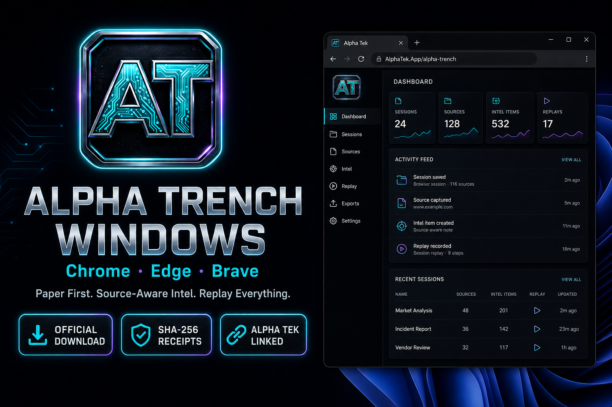
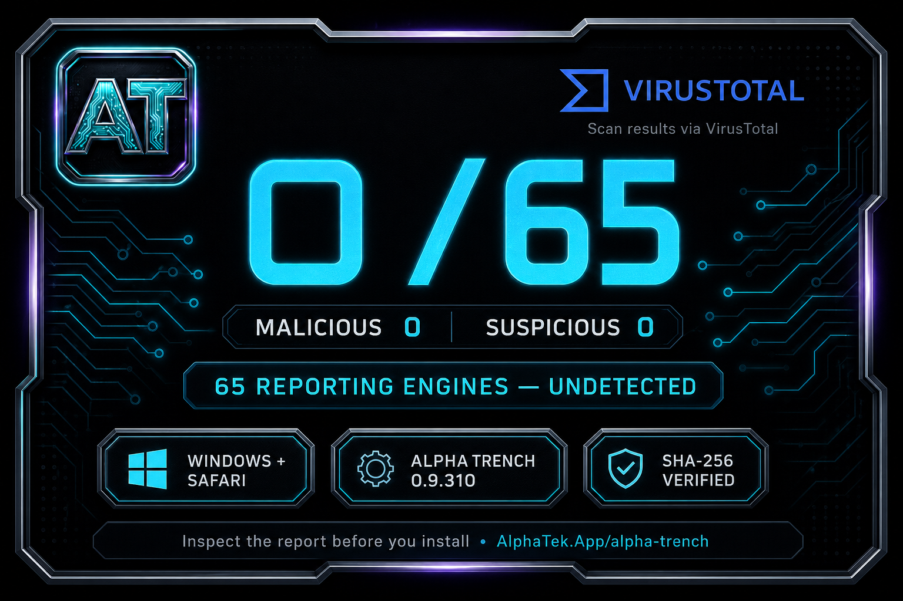

<!--
  PUBLIC product page — Alpha Trench on Windows (Chrome / Edge).
  Packages are distributed through authenticated AlphaTek.App downloads.
-->

  

  <h1>Alpha Trench Windows</h1>

  

    <strong>The Alpha Tek trench client for Windows desks.</strong> 
    Chrome · Edge · Brave · Account-gated AlphaTek.App download
  

  

    Windows is where most trench Chromium installs live. This repository is the
    <strong>Windows information, changelog, and support page</strong>. Development
    source remains private.
  

  

    
    &nbsp;
    
    &nbsp;
    
  

  

  <strong>Windows 0.9.310:</strong>
  <a href="https://www.virustotal.com/gui/file/56863fbf0bcc5c9e9778b6b45239213a36064bd353a56fbdd7cfa62442d8db71">Open the Public VirusTotal Report</a>
  · 0 malicious · 0 suspicious · 65 undetected

---

## Hear The Pad

Product VO: [overlay-bumper.mp3](https://github.com/JohnnyxSmokes/alpha-trench/blob/main/assets/overlay-bumper.mp3) · live on [AlphaTek.App/alpha-trench](https://www.AlphaTek.App/alpha-trench)

## Download Alpha Trench

- **Official Windows Download:** [AlphaTek.App/alpha-trench](https://www.AlphaTek.App/alpha-trench)
- Sign in with your Alpha Tek account to receive the current package.
- **What Changed:** [CHANGELOG.md](CHANGELOG.md)

## Install on Windows (unpacked)

1. Sign in and download the Windows zip from [AlphaTek.App/alpha-trench](https://www.AlphaTek.App/alpha-trench), then unzip it.
2. Open Chrome or Edge → `chrome://extensions` or `edge://extensions`.
3. Enable **Developer mode**.
4. **Load unpacked** → select the `extension` folder (the one with `manifest.json`).
5. Pin **Alpha Trench**. Open Axiom / Padre / Photon and wait for the live mark.

Chrome Web Store listing is in progress. This repository does not contain the development source or package archive.

---

## Trust

| Check | Where |
|-------|--------|
| Package | Account-gated download from [AlphaTek.App](https://www.AlphaTek.App/alpha-trench) |
| Integrity | Version and SHA-256 are returned with the official download |
| License | Historical releases through 0.9.239 retain MIT; future releases are proprietary |
| Mac Safari | [alpha-trench-safari](https://github.com/JohnnyxSmokes/alpha-trench-safari) |

Never paste a seed phrase into the extension. Paper first. Mainnet Instant Trade stays locked until armed.

---

## Linked Alpha Tek Intelligence

When linked to AlphaTek.App, the Windows client can request source-aware Pump ecosystem context reconciled from PumpPortal WebSocket, Frontend V3 REST, and FluxBeam WebSocket/Moralis fallback. Pump.fun and BONK/Raydium provenance stays labeled and selectable.

---

## Trench Replay Stack (Web + Extension)

Alpha Tek ships the **most tech-packed replay stack on Solana** — not a chart embed bolt-on.

| Mode | Surface |
|------|---------|
| **Market Replay** | Any token on [AlphaTek.App](https://www.alphatek.app) |
| **Trench Theater** | [alphatek.app/dashboard/alpha-replay](https://www.alphatek.app/dashboard/alpha-replay) — Cast, Forecast, drawings |
| **Trade Replay** | Alpha Trench extension dashboard (linked wallet) |

Full marketing reference: [TRENCH_REPLAY_STACK.md](https://github.com/JohnnyxSmokes/alpha-trench/blob/main/TRENCH_REPLAY_STACK.md) (on the alpha-trench repo when published).

---

## Ecosystem

| Plane | Link |
|-------|------|
| **Windows Package** | [AlphaTek.App/alpha-trench](https://www.AlphaTek.App/alpha-trench) |
| **Safari** | [alpha-trench-safari](https://github.com/JohnnyxSmokes/alpha-trench-safari) |
| **Portal** | [alphatek.app](https://www.alphatek.app) |
| **Discord** | [discord.gg/epicalpha](https://discord.gg/epicalpha) |
